# Diffusion Probabilistic Model in Jax

This repository serves as a simple code-base to perform experimentation with original diffusion approaches ([DDIM](https://arxiv.org/abs/2010.02502) and [DDPM](https://proceedings.neurips.cc/paper/2020/file/4c5bcfec8584af0d967f1ab10179ca4b-Paper.pdf)), and not stable diffusion---which can easily be added. Specifically, the code is simple to read and flexible enough to be modified for one own usage. This implementation includes both ddim and ddpm sampling written using jax primitives for jit-compilation unlike the commonly found [jax-based diffusion repository](https://github.com/yiyixuxu/denoising-diffusion-flax).

<p align="left">
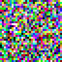
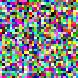
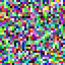
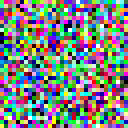
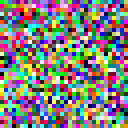
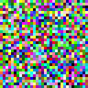
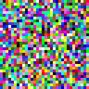
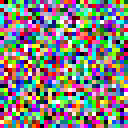
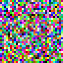
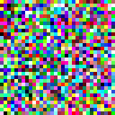
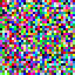
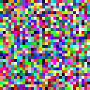
</p>

# Installation
```python
pip install -r requirements.txt
```
If you encounter trouble with installing [Jax](https://github.com/google/jax), please refer to its documentation.

<p align="left">
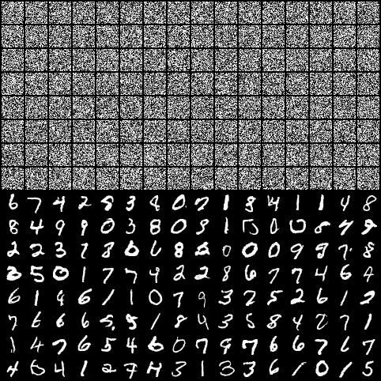
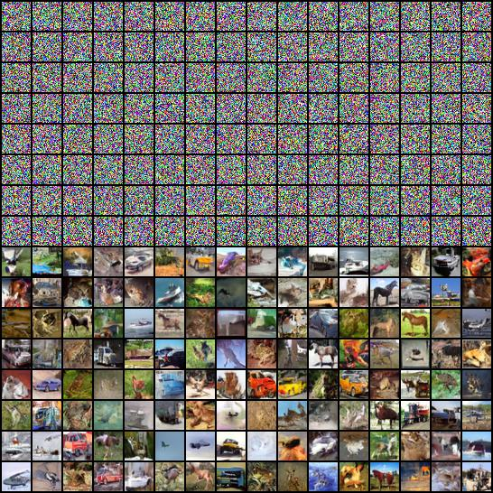
</p>

# Training
```
python train_unet.py \
    --loss_type pred_v \ 
    --min_snr_gamma 5.0 \
    --timesteps 1000 \ 
    --sampling_steps 250 \ 
    --seed 3867 \ 
    --save_every_k 5 \ 
    --max_to_keep 5 \ 
    --epochs 1000 \ 
    --batch_size 128 \
    --num_workers 0 \ 
    --gradient_accummulation_steps 1 \ 
    --pin_memory True \ 
    --learning_rate 0.0001 \ 
    --weight_decay 0.0001 \ 
    --max_ema_decay 0.9999 \ 
    --min_ema_decay 0.0 \ 
    --ema_decay_power 0.66667 \ 
    --ema_inv_gamma 1 \ 
    --start_ema_update_after 100 \ 
    --update_ema_every 10 \ 
    --result_path ./unet_cifar10 \ 
    --dataset cifar10 \ 
    --root_folder ../data \ 
    --beta_schedule sigmoid \ 
    --dim 64 \ 
    --dim_mults 1,2,4,8 \ 
    --resnet_block_groups 8 \ 
    --learned_variance False \
    --clear_gpu_cache False 
```
Note, checkpointing is used and thus, you can continue training from a checkpoint if stopped abruptly.

## Model Creation
For more information, take a look at **train.py** in **src/utils** and the jupyter notebook provided in **nbs**. 
```python
import jax
import numpy as np
from src import Unet

# create empty values for initialization --- note the first dimension is being vmapped over.
x = np.ones([1, 32, 32, 3])            
t = np.ones([1])

# seed
key = jax.random.PRNGKey(42)

# initialize model
params = model.init(key, x, t)['params']

# usage
score = model.apply({'params': params}, x, t)
```

## Sampling
<p align="center">
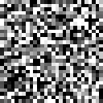
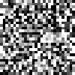
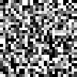
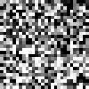
</p>


```python
import equinox as eqx
from src import linear_schedule, ddim_sample, ddpm_sample, get_var_params, get_pred_fn, get_time_pairs

loss_type = "pred_v"

timesteps = 1000
sampling_steps = 250

# variance scheduler
betas = linear_schedule(timesteps)
var_params = get_var_params(betas)

# predict function: x0, noise, and v
pred_fn = get_pred_fn(loss_type)


# compile these functions
ddpm_sample_fn = eqx.filter_jit(ddpm_sample)
ddim_sample_fn = eqx.filter_jit(ddim_sample)

# ddpm-sampling
x_ddpm = ddpm_sample_fn(
    params, 
    model.apply, 
    pred_fn, 
    x, 
    np.arange(timesteps),
    key, 
    var_params, 
    timesteps
)

# ddim-sampling
time_pairs = get_time_pairs(timesteps, sampling_steps)

x_ddim = ddim_sample_fn(
    params, 
    model.apply, 
    pred_fn, 
    x, 
    time_pairs,
    key, 
    var_params, 
    sampling_steps,
    0.0
)
```
## Pmap or Multi-gpu Usage
A common jax util function is **jax.pmap**. For ease of usage, this library takes advantage of [equinox](https://github.com/patrick-kidger/equinox) utility functions. Keep in mind, **jit** is also applied when **pmap** is used.
```python
from src import shard, unshard
from flax.jax_utils import replicate


# batch_size x image_shape
x = np.random.ones([256, 32, 32, 3])

# num_gpus x (256 // num_gpus) x 32 x 32 x 3
x = shard(x)

# replicate params for each gpu
replicate_params = replicate(params)

# Specifying None means the variable is static while a number indicates the axis being mapped over.
ddim_sample_fn = eqx.filter_pmap(ddim_sample, in_axes=(0, None, None, 0, None, None, None, None, None))

x_ddim = ddim_sample_fn(
    replicate_params, 
    model.apply, 
    pred_fn, 
    x, 
    time_pairs,
    key, 
    var_params, 
    sampling_steps,
    0.0
)

# batch_size x image_shape
x_ddim = unshard(x_ddim)
```
##  Reloading Model
Checkpointing of the model and management of model's checkpoints are done through [orbax](https://github.com/google/orbax).
```python
from src import create_checkpoint_manager, restore_model

FOLDER = "./unet_pred_v/ckpts"

# create manager for reloading ckpt
ckpt_manager = create_checkpoint_manager(FOLDER)

# specify None for the latest step
ckpt = restore_model(ckpt_manager, latest_step = None)           

# available keys; ckpt is a dict
ckpt['config']
ckpt['params']
ckpt['ema_params']
ckpt['opt_state']

# you can also specify a target dict for proper reloading
my_ckpt = {
    'params': params,
    'opt_state': opt_state,
    'ema_params': ema_params,
    'config': config
}

my_ckpt = restore_model(ckpt_manager, target = my_ckpt, latest_step = None) 
```

## Visualization and General Usage
```python
import numpy as np 
import equinox as eqx
from src import ddim_sample_visual, create_gifs, Unet, get_time_pairs, get_pred_fn

# noise
x = np.random.normal(0, 1, size=[16, 32, 32, 3])

# Using the ckpt from above
config = my_ckpt['config']

pred_fn = get_pred_fn(config['loss_type'])

key = config['key']
timesteps = config['timesteps']
sampling_steps = config['sampling_steps']

# use specify arguments from config
model = Unet(...)

# time_pairs for ddim
time_pairs = get_time_pairs(timesteps, sampling_steps)

ddim_sample_fn = eqx.filter_jit(ddim_sample_visual)

# perform generation where the x at different timesteps are returned as well
x_ddim, x_over_time = ddim_sample_fn(
    my_ckpt['ema_params'],
    model.apply,
    pred_fn,
    x,
    time_pairs,
    key,
    config['var_params'],
    steps = sampling_steps,
    eta = 0.0 # or config['eta']
)

# create animations: you can upscale the images
frames = 100
create_gifs(
    x_over_time, 
    duration = 1 / frames, 
    folder = "./example_gifs/", 
    image_size=(256, 256, 3), 
    num_images=5,
)
```

## Exponential Model Averaging
EMA update adapted from [yiyixuxu](https://github.com/yiyixuxu/denoising-diffusion-flax) is performed using the following equation $$p_{t + 1} = (1.0 - d) p_{old} + (d) p_{new}$$ 
where $d = 1 - (1 + \frac{t}{\gamma})^{-p}$
